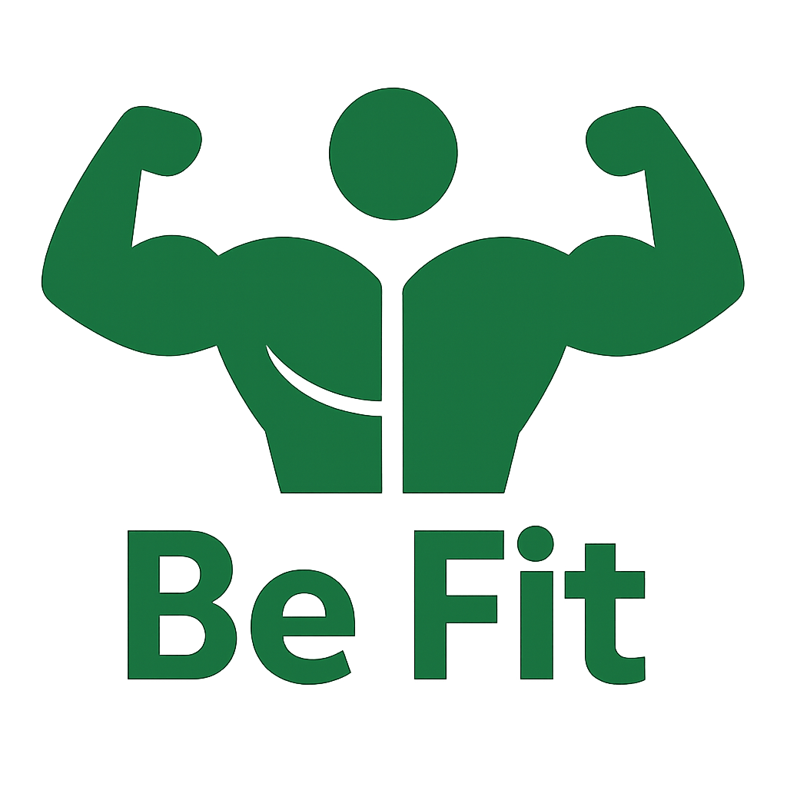

# BeFit : AI 기반 개인 맞춤 헬스 케어 플랫폼

---

## 프로젝트 정보

* **프로젝트 이름**: BeFit
* **팀 이름**: Fitfolio
* **프로젝트 목표**: AI 기반 개인 맞춤 헬스 케어 플랫폼

[BeFit 페이지](./assets/img/BeFit_Main_Page.png)

[BeFit AI 페이지](assets/img/BeFit_AI_Page.png)

[BeFit Video 페이지](assets/img/BeFit_Video_Page.png)

[BeFit Shopping 페이지](assets/img/BeFit_Shopping_Page.png)

[BeFit ChatBot](assets/img/BeFit_ChatBot.png)

---

## 팀 구성

| 역할 | 이름                                   | 주요 기술 및 담당 기능                                                                                                    | 회고록 링크                                                                                                  |
|------|--------------------------------------|------------------------------------------------------------------------------------------------------------------|---------------------------------------------------------------------------------------------------------|
| 팀장 | [왕택준](https://github.com/TJK98)      | Frontend, Gemini API 연동, 핵심 AI 데이터 로직 구현, Local Storage 상태 관리, GitHub 관리, PR 관리, 팀 문서 작성, README 작성, PPT 제작 및 발표 | [왕택준 회고록](https://velog.io/@wtj1998/BeFit-%ED%94%84%EB%A1%9C%EC%A0%9D%ED%8A%B8-%ED%9A%8C%EA%B3%A0%EB%A1%9D) |
| 팀원 | [김다영](https://github.com/llllllllie) | Frontend, YouTube Data API 연동, 맞춤 운동 영상 추천 기능                                                                    | [김다영 회고록](https://github.com/llllllllie/project-retros/blob/main/Be-Fit%20프로젝트) |
| 팀원 | [박현수](https://github.com/hsp64)      | Frontend, Gemini API 연동, AI 챗봇 기능, 메인 페이지                                                                        | [박현수 회고록](https://github.com/hsp64/memoir/blob/main/teamFitfolio20250623.md) |
| 팀원 | [신동준](https://github.com/sdj3959) | Frontend, Naver Shopping API 연동, 상품 검색 및 추천 기능                                                                   | [신동준 회고록](https://github.com/sdj3959/my-retrospectives/blob/master/projects/202506/BeFit/README.md) |

---

## 기술 스택 및 개발 환경

* **Frontend**: HTML5, CSS3, JavaScript (ES6+)
* **API**: Google Gemini API, YouTube Data API, Naver Shopping API
* **개발 도구**: IntelliJ IDEA
* **협업 도구**: Git, GitHub, Discord
* **운영체제(OS):** Windows 11
* **브라우저:** Chrome

### 설치 및 실행 방법

1. 레포지토리 클론 

[BeFit Repository 바로가기](https://github.com/BeFit-crew/BeFit)

2. `assets/js/config.js` 파일 생성 및 API 키 등록

[프로젝트 클론 가이드 문서](./docs/BeFit_Project_Clone_Guide.md)를 확인해 주세요.

3. index.html을 Live Server로 실행

---

## 디렉토리 구조

```
BeFit/
├── .gitignore # Git 추적 제외 파일 설정
├── index.html # 메인 페이지
├── README.md # 프로젝트 소개 문서
│
├── assets/ # 공통 정적 리소스 디렉토리
│ ├── css/ # 메인 CSS 파일
│ ├── img/ # 프로젝트 이미지 리소스
│ └── js/ # 메인 JS 파일 및 환경설정(config.js 등)
│
├── docs/ # 프로젝트 산출/문서 자료
│ ├── meetings/ # 회의록
│ ├── team_rules/ # 팀 규칙/협업 가이드
│
├── src/ # 기능별(페이지별) 소스코드 디렉토리
│ ├── befit-ai/
│ ├── infermedica/
│ ├── playlist/
│ └── shopping/
```

### 폴더/파일별 용도 설명

| 경로                       | 설명                                                      |
|----------------------------|----------------------------------------------------------|
| `.gitignore`               | API 키, 환경설정, 불필요한 파일 등 Git 추적 예외 설정      |
| `index.html`               | 프로젝트 메인(랜딩) 페이지                                |
| `README.md`                | 프로젝트 전체 소개 및 활용 안내                            |
| `assets/`                  | 공통 리소스(이미지, CSS, JS)                              |
| `docs/`                    | 협업문서, 회의록, 트러블슈팅, 환경설정 안내 등            |
| `src/befit-ai/`            | AI 맞춤 추천 페이지 기능                                  |
| `src/infermedica/`         | 의료 상담 챗봇 기능 관련 소스                             |
| `src/playlist/`            | 운동/영상 추천 기능 페이지                                |
| `src/shopping/`            | 쇼핑/상품 추천 기능 페이지                                |


---

## 작업 방식
[팀 협업 문서](./docs/team_rules/befit_team_rules.md)

* 매일 회의를 통해 역할 분담 및 기능 계획 수립
* 회의 내용 회의록 작성 및 공유
* Discord를 통한 실시간 소통
* 기능 단위 브랜치 생성 후 작업, PR로 `dev` 브랜치에 병합
* GitHub Projects로 작업 상태 관리
* 팀장 주도로 커밋/PR/이슈 규칙 공유 및 문서화

### 진행 로그

[2025.06.23 회의록](./docs/meetings/2025-06-23-meeting.md)

[2025.06.24 회의록](./docs/meetings/2025-06-24-meeting.md)

[2025.06.25 회의록](./docs/meetings/2025-06-25-meeting.md)

[2025.06.26 회의록](./docs/meetings/2025-06-26-meeting.md)

[2025.06.27 회의록](./docs/meetings/2025-06-27-meeting.md)

[2025.06.30 회의록](./docs/meetings/2025-06-30-meeting.md)

[2025.07.01 회의록](./docs/meetings/2025-07-01-meeting.md)

[2025.07.02 회의록](./docs/meetings/2025-07-02-meeting.md)

### 개발 기간

| 기간            | 단계                    | 주요 내용                                   |
|-----------------|------------------------|---------------------------------------------|
| 6.23 ~ 6.24     | 1단계: 기획/환경 구축      | 주제 선정, 스택/API 논의, 협업 규칙, 문서화      |
| 6.24 ~ 6.25     | 2단계: UI 설계           | 와이어프레임, 공통 스타일, 레이아웃 정의         |
| 6.25 ~ 6.30     | 3단계: 기능 개발          | 비즈니스 로직, 외부 API 연동, 데이터 처리        |
| 6.30 ~ 7.01     | 4단계: 통합 및 테스트      | 기능 통합, 페이지 연결, 코드 리뷰, UI/UX 개선     |
| 7.02            | 5단계: 발표/회고          | 결과물 발표, 팀 회고, 성과 정리                  |
| 7.03~           | Next Step                | 사용자 피드백 반영, 추가 기능 업데이트 예정      |

---

## 프로젝트 설명

### 핵심 컨셉: 생성, 확장, 상호작용

1. **생성**: 사용자 프로필 기반 AI 맞춤 건강 계획(JSON) 실시간 생성
2. **확장**: 계획 키워드로 상품·영상 등 정보 확장
3. **상호작용**: AI 챗봇을 통한 실시간 상담 및 지속 관리

### 시스템 아키텍처

```plaintext
+-------------------+
|   User Browser    |
|   (Frontend)      |
+----|----------|---+
     |          |
     v          |
[ Local Storage ]  (AI 맞춤 데이터 저장/공유)
     |          |
     v          |
[ Gemini API ]   (계획)
[ Gemini API ]   (챗봇)
[ Naver API ]    (쇼핑)
[ YouTube API ]  (영상)
```

---

## 트러블 슈팅

### 개인별 트러블슈팅

- **왕택준**
  - *문제*: Gemini API 응답 형식 불안정 → 일관성 부족
  - *해결*: 프롬프트 엔지니어링+후처리 로직 적용, 항상 일정 포맷 제공
- **김다영**
  - *문제*: YouTube 추천 결과 중복
  - *해결*: 무의미한 재호출 방지, 최초 결과 정확도 개선
- **박현수**
  - *문제*: 유료 의료 API 대체 필요
  - *해결*: Gemini API로 전환, 전문성 강화 프롬프트 설계
- **신동준**
  - *문제*: Naver API CORS 에러
  - *해결*: 공개 프록시 서버 활용

### 팀 트러블슈팅: 공용 모듈 Null 참조 오류

- **문제**: DOM 의존 공용 모듈이 특정 페이지에서 Null 오류 발생
- **해결**: 자세한 해결 방법은 [공용 모듈 Null 참조 오류 문서](./docs/BeFit_JavaScript_Troubleshooting-Null-Reference.md)를 확인해 주세요.

---

## 향후 업데이트 계획

1. **사용자 인증/DB 연동** (회원가입/로그인, 데이터 영속성)
2. **오프라인 연계** (지도 API, 위치 기반 추천)
3. **동기부여 시스템** (캘린더, To-Do List, 데이터 시각화)
4. **프리미엄/커머스 연계** (구독, 건강 상품 제휴)

---

## 문의 및 지원

이 프로젝트는 [MIT License](./LICENSE)로 공개되어 있습니다.  
자유롭게 사용, 수정, 배포할 수 있으며,  
자세한 내용은 LICENSE 파일을 참고해 주세요.

> 궁금한 점은 언제든 GitHub Issue, 댓글, 혹은 메일로 문의 바랍니다.

[BeFit Repository 바로가기](https://github.com/BeFit-crew/BeFit)

이메일: [wtj1998@naver.com](mailto:wtj1998@naver.com)